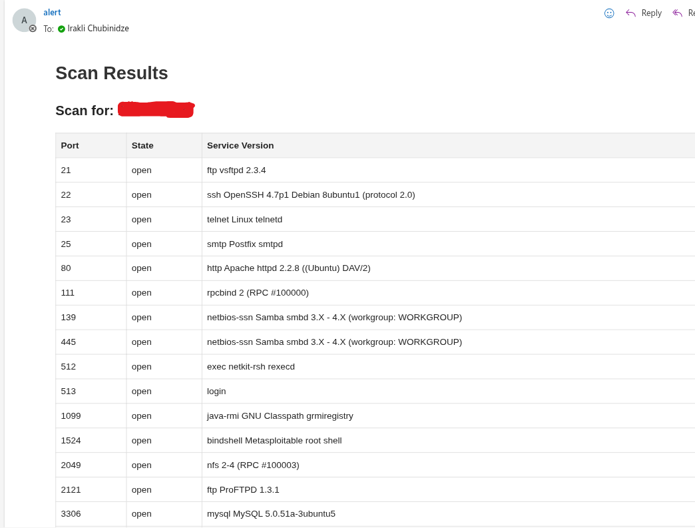

# 🔍 Network Scanner & Email Reporter

This tool helps automate network reconnaissance by:

1. 🧠 Reading a list of IPs or subnets from `ips.txt`
2. 🚀 Scanning live hosts and open services using Nmap
3. 📊 Generating a clean, readable HTML report
4. 📧 Sending the report to configured email recipients

---



## 📁 Project Structure

├── main.py # Main runner: scanning + reporting + emailing

├── scanner.py # Handles ping and port scanning with Nmap

├── report_generator.py # Generates HTML report using Jinja2

├── emailer.py # Sends email via SMTP

├── ips.txt # Target IPs and networks

├── requirements.txt # Python dependencies

## 📦 Setup
```
Clone the repository:
git clone https://github.com/iraklichubinidze/Network-Scanner-Emailer.git
cd network-scanner-emailer

Install dependencies:
pip install -r requirements.txt

Install Nmap (If not already installed):
sudo apt install nmap

▶️ Run the Tool
python3 main.py

```

## ⚙️ Configuration

### 🔧 `main.py`

Update these email settings before running the script:

```python
SMTP_LOGIN = "your_email@example.com"
SMTP_PASSWORD = "your_password"
SENDER_EMAIL = "your_email@example.com"
RECEIVER_EMAILS = ["recipient1@example.com", "recipient2@example.com"]

Optional SMTP settings:
SMTP_SERVER = "smtp.gmail.com"
SMTP_PORT = 587  # Use port 465 or another if your provider requires it
```

### 🔧 `scanner.py`
```python
# Don't change; (used for discovering live hosts)
NMAP_PING_SCAN_OPTIONS = ["-sn"]

# Port scan options — You can customize this safely
NMAP_PORT_SCAN_OPTIONS = ["-v", "-sV", "--open"]

# Don't change; Output formats (internal use)
NMAP_OUTPUT_FORMAT = "-oG"
NMAP_SAVE_FORMAT = "-oN"

# Filter out unhelpful 'tcpwrapped' lines
FILTER_TCPWRAPPED = True

# Avoid scanning too large networks
ALLOWED_SUBNET_SIZE = 4096
```

### ✅ You may customize NMAP_PORT_SCAN_OPTIONS to include flags like:

-p 22,80,443 → Scan specific ports

-T4 → Set aggressive timing (1-5)

--script=banner → Run basic scripts like banner grabbing

## ✍️ `Sample ips.txt`
```txt
192.168.0.0/24
10.0.0.10
10.0.0.11
```


## 🤖 Running the Scanner Automatically with Cron
To automate scans, you can schedule your script using cron on Linux or Unix systems. Cron allows you to run commands periodically at fixed times.

Sample Cron Jobs
```
Run daily at 2:00 AM
0 2 * * * /usr/bin/python3 /path/to/main.py

Run weekly on Sundays at 3:30 AM
30 3 * * 0 /usr/bin/python3 /path/to/main.py

Run monthly on the 1st day at 4:15 AM
15 4 1 * * /usr/bin/python3 /path/to/main.py

How to Edit Cron Jobs
Run:
crontab -e
```
Add one of the lines above with your correct Python path and script location. Save and exit to enable the schedule.

